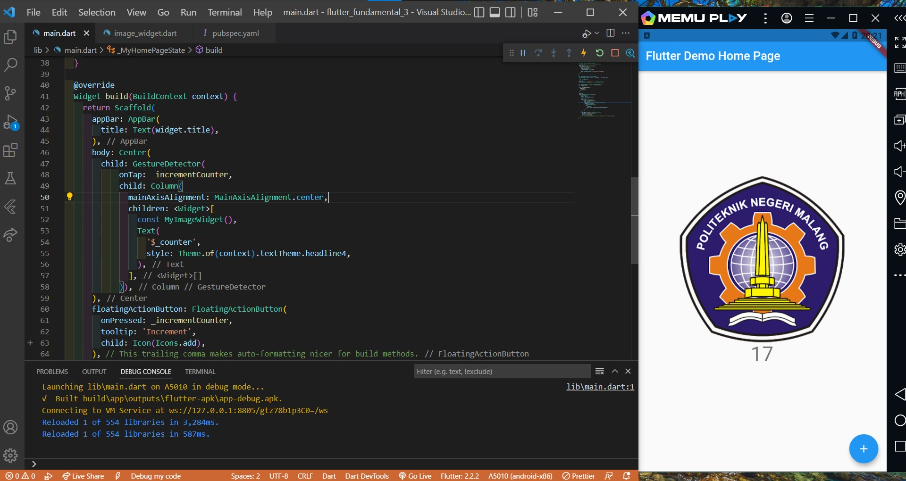
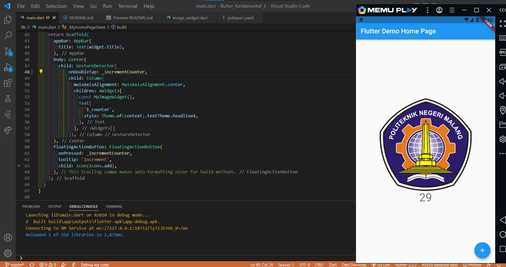
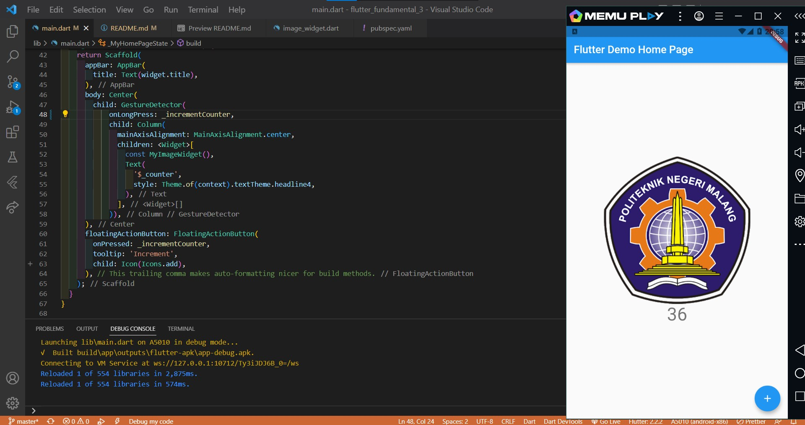
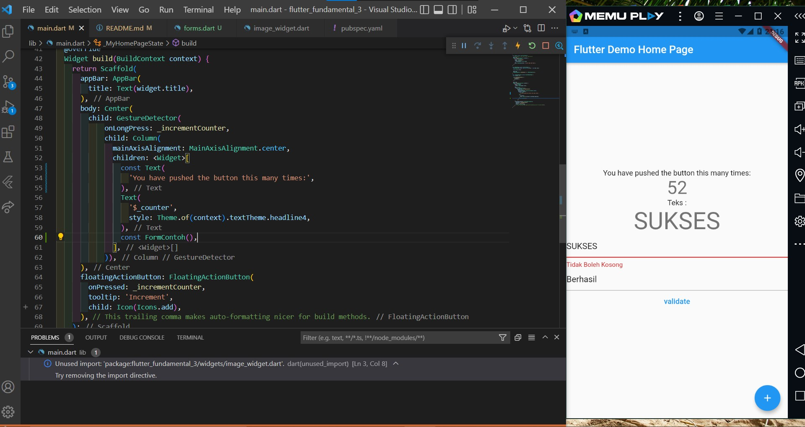
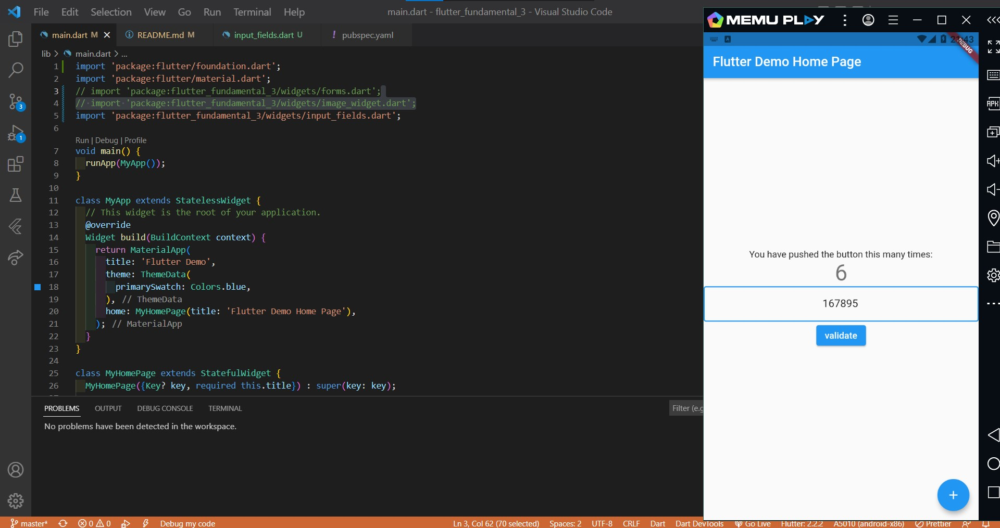

# flutter_fundamental_3

## Praktikum 1: Menerapkan Gesture Detector

onTap

Pada saat gambar diklik maka angka akan terus bertambah, karena gambar tersebut berada di dalam widget GestureDetector yang menyimpan method incrementCounter pada onTap.

onDoubleTap

Angka akan bertambah jika diklik 2x karena widget GestureDetector menggunakan listener onDoubleTap.

onLongPress

Angka akan bertambah ketika menekan dan menahan beberapa detik karena menggunakan listener onLongPress.

## Praktikum 2: Menerapkan Input Widget dan Forms

Pada bagian ini ditampilkan teks sesuai yang diinputkan user pada text form field pertama. Setelah menginputkan teks dan mengeklik validate, jika text form field pertama kosong maka terdapat pemberitahuan "Tidak boleh kosong".

## Praktikum 3: Menerapkan Custom Input dan FormField Widget

Pada bagian ini terdapat input field yang hanya akan menerima angka, karena inputFormatters pada TextField hanya mengizinkan angka 0 sampai 9 dengan limit 6 karakter. Selain itu, jika menggunakan handphone maka keyboard yang muncul yaitu hanya angka saja karena menggunakan keyboardType: TextInputType.number.
